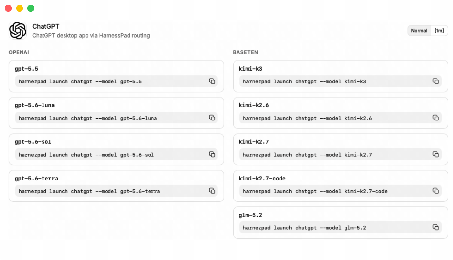

# HarnezPad

HarnezPad is a macOS app that connects your coding agents to your team’s LLM gateway. Launch Claude Code, Codex CLI, ChatGPT, or OpenCode through the `harnezpad` CLI.



## Connect your gateway

1. Create a Full Access key in your gateway dashboard.
2. Open HarnezPad. On first launch — or whenever the key is missing, expired, or invalid — the onboarding dialog asks you to paste it.
3. You can also paste it later under **Settings → Gateway**. HarnezPad validates it against the gateway, then stores it in the macOS Keychain.
4. The gateway endpoint is managed in Settings. Models, Keys, and spend load once a valid key is connected.

Inference-only keys cannot manage virtual keys. Use a Full Access key.

## Use the CLI

The packaged app installs `~/.local/bin/harnezpad` on first launch (a symlink to `HarnezPad.app/Contents/Resources/harnezpad`). Put `~/.local/bin` on your `PATH`.

Launch your preferred coding agent:

```sh
harnezpad launch claude
harnezpad launch codex
harnezpad launch chatgpt
harnezpad launch opencode
```

Each command needs the matching app installed (`claude`, `codex`, ChatGPT.app / Codex.app, or `opencode`).

### Choose a model

Pass a gateway model ID with `--model` (IDs are forwarded unchanged):

```sh
harnezpad launch claude --model kimi-k3
harnezpad launch codex --model gpt-5.5
harnezpad launch chatgpt --model glm-5.2
harnezpad launch opencode --model claude-sonnet-5
```

When `--model` is omitted, the CLI opens an interactive picker. Type to filter, use the arrow keys, and press Enter to launch.

### Keys and restore

```sh
harnezpad launch claude --key my-dev-key --model kimi-k3
harnezpad launch chatgpt --restore
harnezpad launch codex --restore
```

`--key` selects a named Keychain slug. `--restore` undoes ChatGPT desktop routing or the Codex CLI launch profile.
