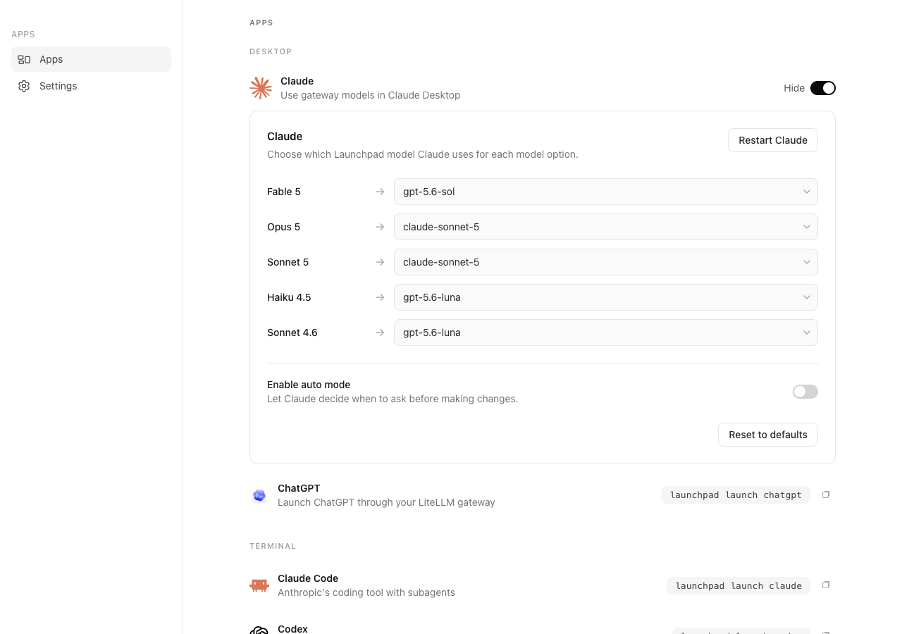
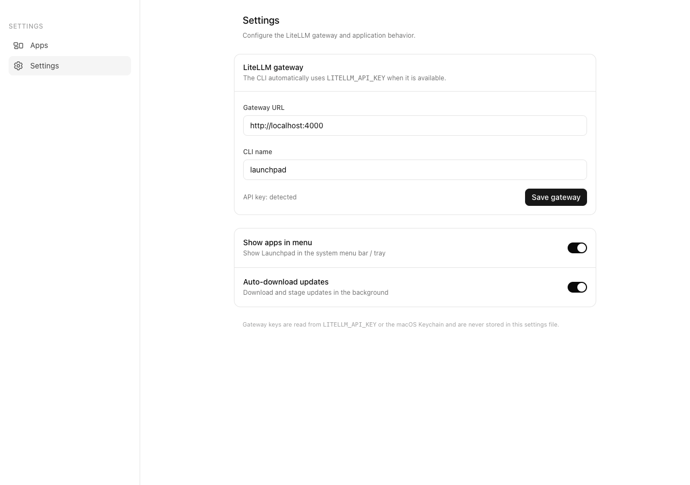

# Launchpad

Launchpad connects supported desktop and terminal AI tools to an OpenAI-compatible gateway such as LiteLLM.

Supported tools:

- Desktop: Claude Desktop and ChatGPT
- Terminal: Claude Code, Codex, OpenCode, and Copilot CLI

## Screenshots

### Apps and Claude Desktop configuration



### Settings



## Configure

Launchpad reads the gateway key from `LITELLM_API_KEY` and does not save it in the settings database.

```sh
export LITELLM_API_KEY=...
launchpad config set-gateway https://gateway.example.com
```

Use `LITELLM_BASE_URL` to override the saved gateway URL for one process. The default URL is `http://localhost:4000`.

The command shown in the desktop app defaults to `launchpad`. Change it with:

```sh
launchpad config set-cli-name NAME
```

`LAUNCHPAD_CLI_NAME` overrides the saved name for one process.

## Run the desktop app

Build the UI and launch the app:

```sh
npm --prefix ui install
npm --prefix ui run build
go run .
```

For Vite hot reload, run these commands in separate terminals:

```sh
npm --prefix ui run dev
go run . -dev
```

Set `LAUNCHPAD_HEADLESS=1` to run the server without opening a window. On macOS, the settings database is stored at `~/Library/Application Support/Launchpad/db.sqlite`.

## Launch a terminal tool

```sh
launchpad launch claude
launchpad launch codex
launchpad launch opencode
launchpad launch copilot
launchpad launch chatgpt
```

Without `--model`, an interactive terminal opens a searchable model picker. It supports arrow keys, Page Up and Page Down, typing to filter, Enter to select, and Escape to cancel.

Pass a model or gateway URL explicitly when needed:

```sh
launchpad launch claude --model <gateway-model-id>
launchpad launch claude --gateway-url https://gateway.example.com
```

ChatGPT configuration requires confirmation and prints a restore command. Use `--yes` only for intentional non-interactive automation:

```sh
launchpad launch chatgpt --model <gateway-model-id> --yes
launchpad launch chatgpt --restore --yes
```

Claude Desktop uses a local compatibility endpoint provided by Launchpad. Keep Launchpad running while using gateway models in Claude Desktop.

## Verify

```sh
go test -race -timeout 60s ./...
go vet ./...
npm --prefix ui run build
```
