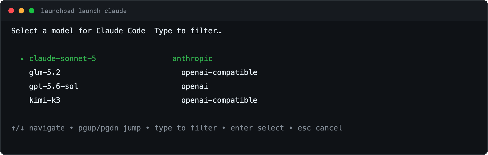
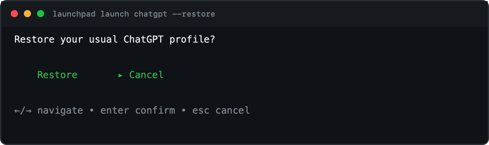

# Launchpad

Launchpad connects desktop and terminal AI tools to a configurable OpenAI-compatible provider such as LiteLLM. It discovers available models, lets the user choose one interactively, and starts each tool with an isolated provider configuration.

## Capabilities

- **One provider configuration.** Set one provider URL and one `LAUNCHPAD_PROVIDER_API_KEY`. Launchpad adapts them to the configuration format expected by each supported tool.
- **Provider-aware model discovery.** LiteLLM providers use the model-group catalog with an OpenAI fallback. OpenAI-compatible providers use `/v1/models`, and deployments with a custom catalog can set an explicit models URL. Model IDs pass through unchanged.
- **Interactive model selection.** The terminal picker supports type-to-filter, arrow navigation, Page Up and Page Down, Enter to select, and Escape to cancel.
- **Terminal integrations.** Launch Claude Code, Codex, OpenCode, and Copilot CLI without modifying their persistent user configuration.
- **Desktop integrations.** Configure Claude Desktop through a local compatibility service and ChatGPT through a managed profile block.
- **Safe ChatGPT restore.** Launchpad captures the previous ChatGPT model settings before changing them and provides an interactive restore command.
- **Credential isolation.** Provider keys come from `LAUNCHPAD_PROVIDER_API_KEY` or the macOS Keychain. They are not written to Launchpad's settings file or inherited unnecessarily by child processes.
- **Build-time branding.** Distributors can compile a permanent CLI name that is used in help, desktop commands, and restore instructions.
- **Desktop management UI.** Configure the provider, map Claude Desktop model slots, copy launch commands, and control application preferences.

## Screenshots

### Apps and Claude Desktop configuration

<table><tr><td>

</td></tr></table>

### Provider settings

<table><tr><td>

</td></tr></table>

### Interactive model picker

<table><tr><td>

</td></tr></table>

### ChatGPT restore confirmation

<table><tr><td>

</td></tr></table>

## How it works

1. Launchpad resolves the provider profile from saved settings and `LAUNCHPAD_PROVIDER_*` overrides.
2. It resolves the provider key from `LAUNCHPAD_PROVIDER_API_KEY`, then the macOS Keychain.
3. If `--model` is omitted, the provider client fetches the model catalog and opens the interactive picker.
4. The launcher translates the selected model, provider URL, and key into tool-specific arguments, environment variables, or profile files.
5. Terminal tools run with a constructed child environment. Desktop tools are restarted only when their profile changes require it.

The [implementation guide](docs/implementation.md) documents the architecture, each tool integration, provider configuration, and extension points.

## Configure the provider

```sh
export LAUNCHPAD_PROVIDER_API_KEY=...
launchpad config set-provider https://provider.example.com --kind litellm
```

For a standard OpenAI-compatible provider:

```sh
launchpad config set-provider https://provider.example.com/v1 --kind openai-compatible
```

Add `--models-url https://catalog.example.com/models` when model discovery uses a separate OpenAI-compatible endpoint. `LAUNCHPAD_PROVIDER_URL`, `LAUNCHPAD_PROVIDER_KIND`, and `LAUNCHPAD_MODELS_URL` override saved values for one process. The default profile is LiteLLM at `http://localhost:4000`.

## Run the desktop app

Build the UI and launch the application:

```sh
npm --prefix ui install
npm --prefix ui run build
go run .
```

For Vite hot reload, run these commands in separate terminals:

```sh
npm --prefix ui run dev
go run . -dev
```

Set `LAUNCHPAD_HEADLESS=1` to run the service without opening a window. On macOS, settings are stored at `~/Library/Application Support/Launchpad/`.

## Launch a tool

```sh
launchpad launch claude
launchpad launch codex
launchpad launch opencode
launchpad launch copilot
launchpad launch chatgpt
```

Select a model and provider explicitly when needed:

```sh
launchpad launch claude --model <provider-model-id>
launchpad launch claude --provider-url https://provider.example.com
```

ChatGPT configuration requires confirmation and prints a restore command. Use `--yes` only for intentional non-interactive automation:

```sh
launchpad launch chatgpt --model <provider-model-id> --yes
launchpad launch chatgpt --restore --yes
```

Claude Desktop uses a local compatibility endpoint provided by Launchpad. Keep Launchpad running while using provider models in Claude Desktop.

## Set the build-time CLI name

The `-X` value controls names shown in help, restore instructions, and the desktop app. The `-o` value gives the binary the same name:

```sh
CLI_NAME=my-launcher
go build -ldflags "-X launchpad/internal/config.DefaultCLIName=$CLI_NAME" -o "$CLI_NAME" .
```

Without these build flags, the CLI name is `launchpad`.

## Verify

```sh
go test -race -timeout 60s ./...
go vet ./...
npm --prefix ui run build
```
